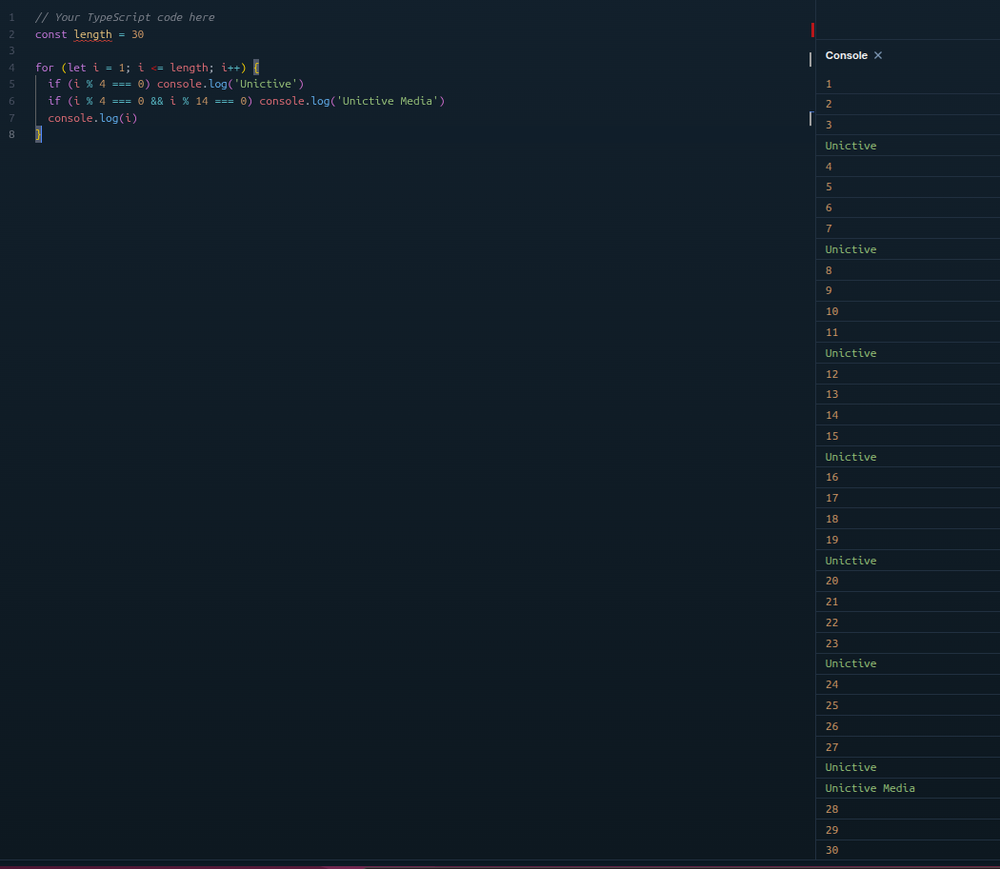

# UNICTIVE TEST – Ionic Angular App

## Simple Product List Fetch Application built using **Ionic 7 (Angular Standalone)**.

This project demonstrates:

- Authentication with session handling (8 hours)
- Route protection (Auth Guard)
- API integration using DummyJSON
- Product listing with pagination (limit & skip)
- Product detail page
- Reusable navbar component

---

### list user can be accessed in [here](https://dummyjson.com/users)

---

### Tech Stack

- Ionic 7
- Angular (Standalone Components)
- RxJS
- DummyJSON API
- node v22+

---

### Installation

Clone repository:

```bash
// USING SSH
git clone git@github.com:bayuSarifudin/unictive-product-list.git

// USING HTTPS
git clone https://github.com/bayuSarifudin/unictive-product-list.git
```

## LOOPING TEST

### QUESTION

```
Coba dibikin angka dengan looping 1-30
Setiap angka hasil pembagian dari 4 adalah 0 , maka angka dirubah menjadi unictive,
jika angka hasil pembagian dari 14 dan 4 hasilnya 0 maka angka diubah menjadi Unictive Media
```

### ANSWER CODE

```
  const length = 30

  for (let i = 1; i <= length; i++) {
    if (i % 4 === 0) console.log('Unictive')
    if (i % 4 === 0 && i % 14 === 0) console.log('Unictive Media')
    console.log(i)
  }
```

### RESULT EXAMPLE


